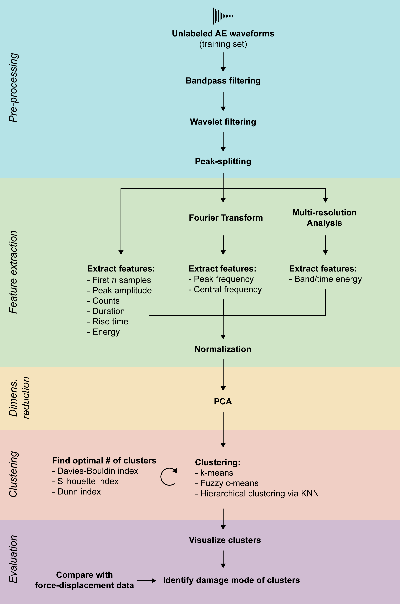

# Damage mode identification for composites
This is the repository for the [AE2223-I](https://studiegids.tudelft.nl/a101_displayCourse.do?course_id=54305) project of group D5. The goal is the identification of the damage mode in composites under compression after impact based on acoustic emission measurements. A data analysis pipeline consisting of pre-processing, feature extraction, dimensionality reduction and clustering performs this task. See the [research plan](docs/Research_plan.pdf) for more details on the project.

## Setup
To get started with development:
1. Ensure that Python 3.8 or 3.9 is installed.
2. Clone the GitHub repository by clicking on the green "Code" button above and follow the instructions.
3. Open the cloned folder in PyCharm (other IDEs can be used, adjust the following instructions accordingly).
4. Add a new interpreter in a [Virtualenv environment](https://docs.python.org/3/tutorial/venv.html). This ensures isolation so that the packages for this project do not conflict with your preinstalled ones.
5. Install all required packages by opening `requirements.txt` and clicking "Install requirements". This ensures that everyone uses the same package versions, preventing bugs that might be hard to find.
6. Read the code and Git guidelines in this document so the code stays consistent and clear.

## Usage
To run the code from the console, make sure you are in the project directory and activated the virtual environment (`<venv>\Scripts\activate.bat` on Windows, `source <venv>/bin/activate` on Linux).

The main script can then be executed using `python -m damage_identification [mode]` where possible modes are:
* `train`: train the pipeline (mostly feature extraction, PCA and clustering) on a training data set
* `predict`: predict the damage mode of one or multiple examples using a trained pipeline 
* `evaluate`: compile metrics about the classification performance of the pipeline based on an evaluation data set
* `--help`: show a help message with all possible command line options. This can also be appended to every mode to show mode-specific options.

### Configuration parameters

Configurable parameters are passed to the pipeline as command line arguments during training
using `--parameter_name value`. The following parameters are available:

* `direct_features_threshold` (float): threshold for direct features like counts and duration
* `direct_features_n_samples` (int): how many raw first `n` samples should be used as features, without further transformation
* `direct_features_max_relative_peak_error` (float): for double peak rejection, determines how large the smaller peak is allowed to be relative to the larger peak to not be rejected
* `direct_features_first_peak_domain` (float between 0 and 1): for double peak rejection, determines at which
* `n_clusters` (int or "start...end"): number of clusters (e.g. for k-means), determined based on multiple indices if range of k is specified
* `explained_variance` (float between 0 and 1): desired level of explained variance for PCA selection

## Code Guidelines

This project uses the [_Black_ code style](https://github.com/psf/black) for consistency and clarity. Before committing,
format the project code by running `black .` in the project directory.  For docstrings and comments,
the [Google style](https://google.github.io/styleguide/pyguide.html#38-comments-and-docstrings) is used.

Some more guidelines to follow:
* Write a lot of [unit tests](https://docs.python.org/3/library/unittest.html). This catches errors close to the source and gives you confidence that your code works. If you're using PyCharm, create unit tests for a method by Right-click > Go To > Tests. From the console, all tests can be run using `python -m unittest -v`.
* Use [type hints](https://docs.python.org/3/library/typing.html) and [docstrings](https://google.github.io/styleguide/pyguide.html#38-comments-and-docstrings) for every method. This helps prevent errors and assists others with using your method properly.
* Ideally, only a single person works on a file at a time to prevent merge conflicts. This requires a certain file structure,
  avoiding long files and preferring small, specialized files.
* If you start using a package that is not yet in `requirements.txt`, add it with the specific version you are using, so your code works for everyone else as it does for you.
* If your code creates files that change with every execution or are user-specific, add them to the `.gitignore`.
* If you are writing a new feature extractor or clustering method, read the docstrings of the base classes carefully to implement your class correctly.

### Array Shapes
Clearly documenting the meaning of each dimension in the shape of NumPy arrays/Pandas DataFrames helps prevent errors
that can be hard to find. The following names are used in docstrings for this purpose:

* `n_examples`: the number of examples in this array
* `length_example`: the number of samples in a single example
* `n_features`: the number of features
* `n_features_reduced`: the number of features after PCA
* `n_clusterers`: the number of clusterers in the pipeline

For example, if a number of examples is stored as rows in an array, so that each column contains the sample at a certain
time for all examples, the corresponding shape is `n_examples x length_example`. The 7th sample of the 3rd example can
then be accessed as `array[2][6]` (note that arrays start at 0).

## Git Guidelines
[GitHub Flow](https://docs.github.com/en/get-started/quickstart/github-flow) is used as Git model for this repository. Please become familiar with it before committing. Follow these guidelines:
* The main branch should always be in a usable state.
* Never commit to the main branch directly (in fact, pushing to main is blocked). Always work on your feature branch, then use a pull request to merge your changes into main.
* Use pull requests as platform for discussions and questions. You can open a pull request even if your code is not done yet. Tagging people in pull requests to get feedback on work-in-progress code is explicitly encouraged. Once you're done, the pull request will be approved for merging into main.
* Always start new branch for new feature, do not reuse a branch for multiple features. A feature should be a single component of about a week's work, if more, split into smaller features. Always update main before starting a new feature branch, then start your feature branch from main.
* If it can be avoided, do not merge feature branches into another. This leads to messy pull requests with much manual labor. Instead, use [cherry-picking](https://gitbetter.substack.com/p/how-to-use-git-cherry-pick-effectively) if you need another branches' code before it has been merged into main.
* Commit often, after finishing a small part of a feature, even if the code does not work fully yet. Since you commit to your own feature branch, no one else is affected, and you can keep a history of your changes in case something goes wrong.
* Use descriptive commit messages (not just "fix bugs"). Follow [these guidelines](https://gist.github.com/robertpainsi/b632364184e70900af4ab688decf6f53). Use the imperative ("add" instead of "added") for verbs.
* No data should ever be committed to Git. The repository is for code only. Store any local data files in the `data/` folder which is ignored by commits.

## Data folder layout
All data files (e.g. AE recordings and trained pipeline models) should be stored in `data/` which is not committed. The folder is structures as follows:
* `data/Waveforms.csv`: first AE recording that Davide gave us
* `data/pipeline/`: trained pipeline models for feature extraction and clustering

## Useful topics to learn
In order of decreasing relevance:
* [Object-oriented programming](https://realpython.com/python3-object-oriented-programming/)
* [Unit testing](https://docs.python.org/3/library/unittest.html)
* [GitHub](https://docs.github.com/en/get-started/quickstart/hello-world) and [Git](https://docs.github.com/en/get-started/using-git/about-git)
* [NumPy](https://numpy.org/devdocs/user/quickstart.html) (math and linear algebra package for Python)
* [pandas](https://pandas.pydata.org/docs/user_guide/10min.html) (tabular data package for Python)
* [PyCharm](https://www.jetbrains.com/pycharm/) (highly recommended Python IDE/editor)
* [scikit-learn](https://scikit-learn.org/stable/getting_started.html) (machine learning package for Python)
* [PyTorch](https://pytorch.org/tutorials/beginner/basics/intro.html) (neural network package for Python)

## Glossary:
* Example: a single waveform, term is commonly used in machine learning
* Pipeline: the collective term for all components and the flow of data between them, starting from raw waveforms and ending at the identified damage mode
* Sample: a single data point in a waveform, associated with a certain time
* Training set: the set of examples used to train the pipeline
* Validation set: the set of examples used to evaluate the performance of the pipeline
* Waveform: the acoustic emission measurement recorded by the sensor, made up of samples

## Pipeline

